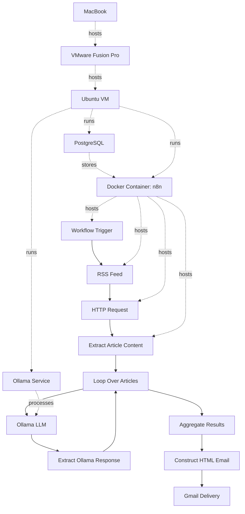

# Cyber Threat Intelligence Digest

An automated cyber threat intelligence aggregation and summarization platform built with **n8n**, **Ollama**, **Docker**, and **Gmail**.

The workflow collects cybersecurity news from RSS feeds, extracts article content, summarizes each article using a locally hosted LLM through Ollama, and delivers a daily email digest in HTML format.

---

## Architecture




---

## Features

- Automated RSS feed ingestion
- Article content extraction
- Local AI-powered summarization using Ollama
- Daily HTML email digest
- Self-hosted with Docker
- No dependency on cloud-based LLM services
- Fully customizable RSS sources and prompts

---

## Technology Stack

- n8n
- Ollama
- Docker
- Docker Compose
- PostgreSQL
- Gmail OAuth
- VMware Fusion (optional)
- Ubuntu Linux VM (optional)

---

## Prerequisites

### Required Software

- Docker
- Docker Compose
- Ollama
- Git

Optional:

- VMware Fusion Pro
- Ubuntu Linux VM

---

## Setup

### Clone Repository

```bash
git clone https://github.com/yourusername/cyber-threat-intelligence-digest.git

cd cyber-threat-intelligence-digest
```

---

### Start Ollama

Install Ollama:

```bash
curl -fsSL https://ollama.com/install.sh | sh
```

Pull a model:

```bash
ollama pull phi3:mini
```

Verify:

```bash
ollama list
```

---

### Start n8n and PostgreSQL

Launch the stack:

```bash
docker compose up -d
```

Verify containers:

```bash
docker ps
```

Expected:

```text
n8n
postgres
```

---

## Accessing n8n

Open a browser:

```text
http://<server-ip>:5678
```

If running on a local VM:

```text
http://<vm-ip>:5678
```

Find VM IP:

```bash
ip addr
```

or

```bash
hostname -I
```

---

## Import Workflow

1. Open n8n.
2. Click **Import from File**.
3. Select:

```text
workflow.json
```

4. Save the workflow.

---

## Gmail Configuration

### OAuth (Recommended)

1. Create a Google Cloud Project.
2. Enable Gmail API.
3. Configure OAuth Consent Screen.
4. Create OAuth Credentials.
5. Configure Gmail OAuth credentials in n8n.


---


## Running in Docker

Start:

```bash
docker compose up -d
```

Stop:

```bash
docker compose down
```

View logs:

```bash
docker logs -f n8n
```

Restart:

```bash
docker restart n8n
```

---

## Backing Up Workflows

Export workflows from n8n:

```text
Workflow
→ Download
```

Store exported JSON files in source control.